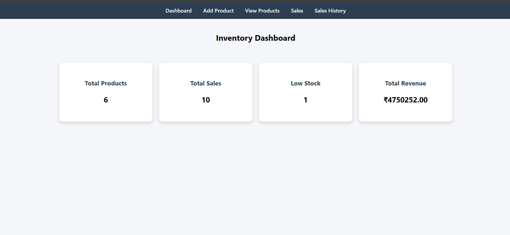
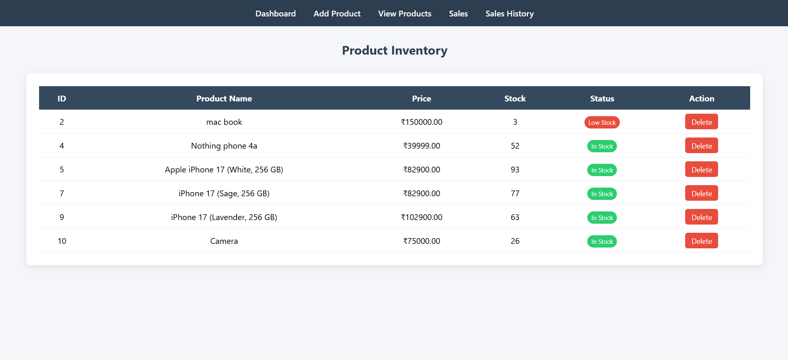
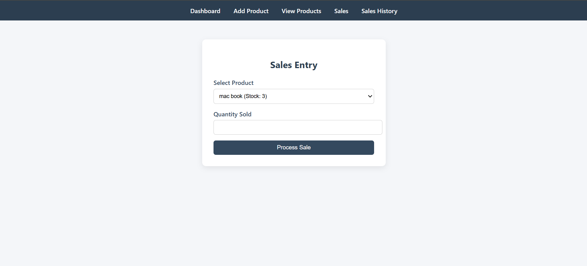

# Inventory-Management-System-PHP-MySQL-
This project is an Inventory Management System developed using PHP and MySQL as part of academic coursework. It allows users to add, view, and manage products, track sales, and monitor stock levels through a simple web interface.

## 🚀 Features

-  Add new products
-  View product inventory
-  Delete products
-  Process sales
-  Track stock levels
-  Low stock indication
-  Dashboard overview

## 🛠️ Tech Stack

- **Frontend:** HTML, CSS  
- **Backend:** PHP  
- **Database:** MySQL  
- **Server:** XAMPP  

## 📂 Project Structure
inventory-system/
│── index.php              # Add Product Page
│── view_products.php      # View Products
│── sales.php              # Sales Entry
│── view_sales.php         # Sales History
│── dashboard.php          # Dashboard
│── db.php                 # Database Connection
│── add_product.php        # Insert Product Logic
│── process_sale.php       # Sales Logic
│── delete_product.php     # Delete Product
│── css/
│    └── style.css

## ⚙️ Setup Instructions

1. Clone the repository:
git clone [https://github.com/aakheel007/Inventory-Management-System-PHP-MySQL-.git](https://github.com/aakheel007/Inventory-Management-System-PHP-MySQL-.git)

2. Move project to XAMPP:

C:\xampp\htdocs\

3. Start XAMPP:
- Apache  
- MySQL   

4. Create database in phpMyAdmin:

CREATE DATABASE inventory;

5. Create tables:
CREATE TABLE products (
product_id INT AUTO_INCREMENT PRIMARY KEY,
product_name VARCHAR(100),
price DECIMAL(10,2),
stock INT
);

CREATE TABLE sales (
sale_id INT AUTO_INCREMENT PRIMARY KEY,
product_id INT,
quantity INT,
sale_date DATE
);

6. Update database config in `db.php` if needed:

$conn = new mysqli("localhost", "root", "", "inventory", 3307);

7. Run project:

[http://localhost/inventory-system/](http://localhost/inventory-system/)

## 📸 Screenshots

> Add screenshots here (recommended)

Example:
- Dashboard:

- Product List:

- Sales Page:

---

## 🎯 Learning Outcomes

- CRUD operations in PHP
- Database connectivity using MySQL
- Form handling and validation
- Basic business logic implementation
- Full-stack integration

---

## 👨‍💻 Author

**Aakheel Shaik**  
GitHub: https://github.com/aakheel007

---

## ⭐ If you like this project

Give it a ⭐ on GitHub!
